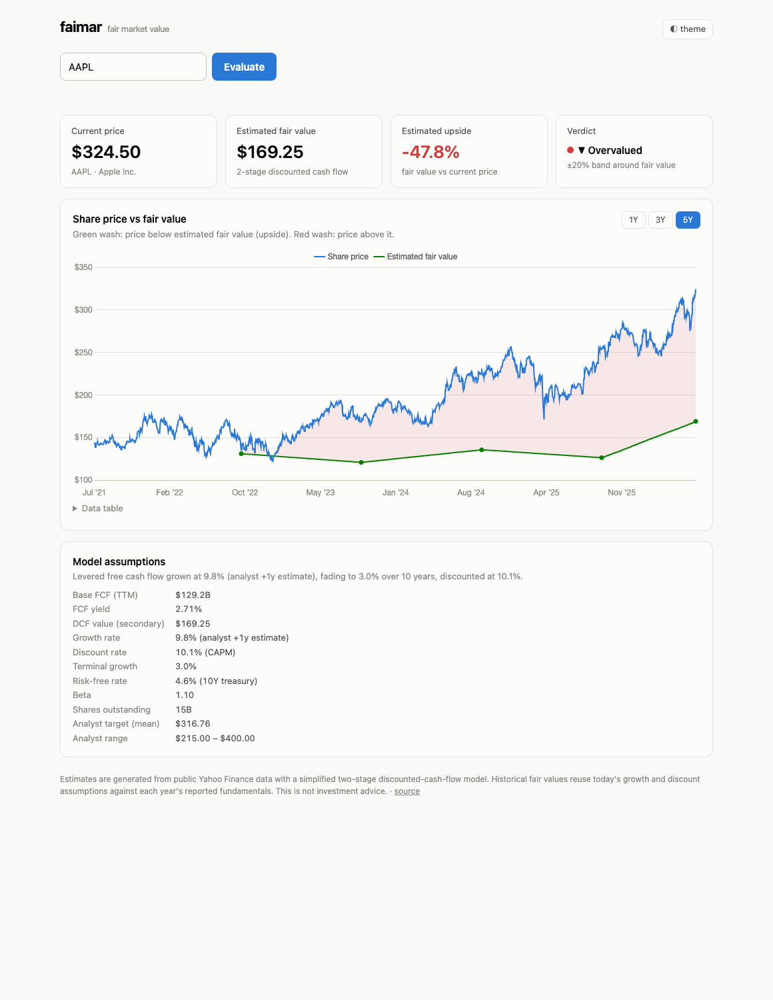

# faimar — fair market value

Plug in a ticker symbol, see its **estimated fair value vs share price** over time,
and the **estimated upside** at the current price — the same style of chart Simply
Wall St / Morningstar publish, built entirely on free data.



## How it works

- **Data sources (free, no API keys):**
  - Yahoo Finance via [`yfinance`](https://github.com/ranaroussi/yfinance) — price
    history, cash flow statements, analyst growth estimates and price targets,
    beta, share counts.
  - Nasdaq's public site API (`api.nasdaq.com/api/analyst/{symbol}/targetprice`)
    — roughly a year of monthly analyst consensus price-target history, the
    free equivalent of the stepped "fair value revisions" line the paid
    platforms chart.
- **Fair value model:** a two-stage discounted cash flow on levered free cash flow
  (the same family of model behind the charts that inspired this):
  1. Start from trailing-twelve-month free cash flow.
  2. Grow it at an analyst-informed rate, fading linearly to a terminal rate
     (capped at the 10-year treasury yield) over 10 years.
  3. Add a Gordon-growth terminal value.
  4. Discount at CAPM: risk-free rate + beta × 5% equity risk premium.
  5. Divide by shares outstanding.

  All inputs are clamped to sane ranges (see `app/config.py`). If free cash flow is
  negative — common for growth companies — fair value falls back to the **mean
  analyst price target**, and the UI labels it as such.
- **Historical fair value line** (a step function — each estimate holds until
  revised) is assembled from three free layers:
  1. *DCF replay:* the model re-run against each past fiscal year's reported FCF
     (and rolling four-quarter TTM values) with that period's diluted share
     count. Today's growth and discount assumptions are held constant across
     history (point-in-time estimates aren't free); the UI discloses this.
  2. *Consensus replay:* when fair value comes from analyst targets, Nasdaq's
     monthly consensus history provides the past revisions.
  3. *Faimar's own log:* every computed estimate is recorded (SQLite) once per
     day, so the site accumulates its own revision history the longer it runs —
     the same way the paid platforms built theirs.
- **Upside:** `(fair value − current price) / current price`, with a ±20% band
  for the undervalued / fair / overvalued verdict.

## Caching

A SQLite file cache (`cache.db`) with per-kind TTLs keeps Yahoo traffic minimal and
the site fast:

| Data | TTL (default) | Env var |
|---|---|---|
| Fundamentals (cash flow, estimates, targets) | 24 h | `FAIMAR_TTL_FUNDAMENTALS` |
| Price history / current price | 30 min | `FAIMAR_TTL_PRICES` |
| Risk-free rate (^TNX) | 12 h | `FAIMAR_TTL_RISK_FREE` |

If Yahoo errors or rate-limits, the cache serves the last known (stale) data
instead of failing — **stale-while-error**. The cache interface is three methods
(`get` / `set` / `fetch`), so swapping SQLite for Redis when hosted is a one-file
change.

## Run locally

```bash
python3 -m venv .venv
.venv/bin/pip install -e '.[dev]'
.venv/bin/uvicorn app.main:app --reload
# open http://127.0.0.1:8000/#AAPL
```

Tests:

```bash
.venv/bin/pytest
```

## API

```
GET /api/v1/valuation/{symbol}
```

Returns price, fair value, upside %, verdict, full model assumptions, analyst
targets, 5-year price history, and the historical fair-value series. `GET /healthz`
for liveness.

## Going live (migration path)

The app is deliberately 12-factor so "hosted" is the same app with env vars:

1. **Containerize** — `docker build -t faimar . && docker run -p 8000:8000 -v faimar-data:/data faimar`.
   The Dockerfile already points `FAIMAR_CACHE_PATH` at a volume.
2. **Pick a host** — anything that runs a container with a persistent volume:
   Fly.io (`fly launch`), Render, or Railway all have hobby tiers. A single small
   instance is plenty; the cache does the heavy lifting.
3. **Put a CDN in front** — Cloudflare free tier for TLS, caching of static assets,
   and basic rate limiting by IP (worth having before sharing the URL, since every
   cache miss costs a Yahoo call).
4. **Scale the cache if needed** — multiple instances shouldn't each hit Yahoo;
   replace `app/cache.py`'s SQLite with Redis (same three-method interface) or pin
   to one instance.
5. **Data source resilience** — Yahoo's endpoints are unofficial. The provider
   layer (`app/providers/`) is pluggable; a keyed provider (e.g. Financial
   Modeling Prep, which has an actual DCF endpoint) can be added alongside and
   selected by env var if Yahoo becomes unreliable at scale.

## Disclaimers

Fair value estimates come from a simplified model over public data. They are not
investment advice, and the numbers will differ from Simply Wall St, Morningstar,
or anyone else's proprietary models.

## License

MIT
